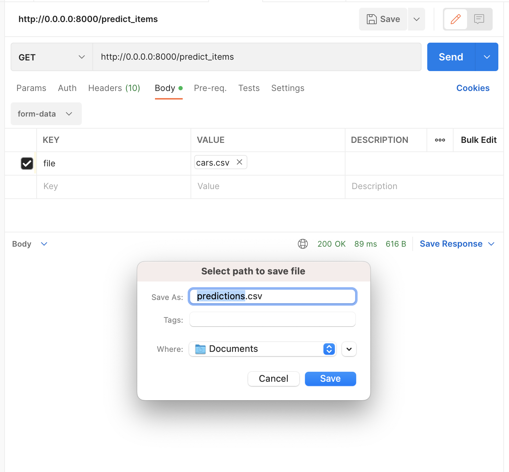

# Предсказание стоимости автомобилей

Предсказание стоимости автомобилей с использованием методов машинного обучения.

## Полученные результаты

### Что было сделано?

1. Загружены исходные данные для тренировочного и для тестового наборов.
2. Проведен разведочный анализ данных и обработка признаков:
   - посчитаны статистики по числовым и категориальным признакам
   - найдены и заполнены пропуски медианными значениями
   - найдены и удалены объекты с одинаковым описанием признаков
   - для признаков, которые можно перевести из текстового формата в числовой сделаны соответствующие преобразования
   - построены графики попарного распределения для числовых признаков
   - построена тепловая карта попарных корреляций для числовых признаков
   - на основании визуализаций сделаны предварительные выводы о наиболее и наименее коррелирующих признаках
3. Работа с признаками:
   - добавлены категориальные признаки с их One Hot преобразованием
   - проведен Feature Engineering с добавлением новых признаков на основе исходных
4. Обучены модели:
   - классическая линейная регрессия
   - Lasso-регрессия
   - Ridge-регрессия
   - ElasticNet
   - с помощью GridSearchCV подобраны оптимальные гиперпараметры для моделей
   - посчитаны метрики R2 и MSE
   - найдена наиболее эффективная модель – на основе Ridge-регрессии
   - наилучшая модель сохранена в pickle-файле
5. Бизнес-метрики:
   - разработана функция для вычисления доли объектов с отклонением предсказанной цены от реальной более чем на 10%.
6. Разработан сервис на FastAPI, который позволяет предсказывать стоимость автомобиля по переданным параметрам:
   - для одного автомобиля (параметры передаются в виде JSON с признаками)
   - для множества автомобилей (параметры передаются в виде списка автомобилей в CSV-файле) 

### С какими результатами?

В ходе работы при помощи GridSearchCV удалось подобрать параметры, дающие наиболее высокую эффективность для моделей.
Среди всех моделей была выбрана наилучшая с R2 Score ~65.
Сервис на FastAPI использует наилучшую модель, сохраненную в виде pickle-файла и выполняет обе функции:
   - предсказание для одного объекта
   - предсказания для множества объектов

Результаты EDA и создания моделей представлены в файле [regression_with_inference.ipynb](regression_with_inference.ipynb).

### Что дало наибольший буст в качестве?

Добавление категориальных признаков после их предобработки и признаки после Feature Engineering.

### Что сделать не вышло и почему?

Ввиду ограниченности ресурсов в данный момент в будущем необходимо провести более качественный Feature Engineering:
   - можно добыть новые признаки из открытых источников по маркам автомобилей
   - добавить пороговые признаки
   - правильно заполнить пропуски (не медианными значениями)
   - извлечь больше числовых значений из категориальных признаков (парсинг с преобразованием единиц измерения)
   - проанализировать выбросы и обработать их
   - логарифмирование признаков для их более равномерного распределения

### Скриншоты работы сервиса

#### Документация API


#### Метод `predict_item`


#### Метод `predict_items`



#### Результат


## Использование

### Установка

1. Клонируйте репозиторий проекта:
    ```bash
    git clone https://github.com/mnv/machine-learning-cars-pricing.git
    ```

2. Для конфигурирования приложения скопируйте файл `.env.sample` в `.env`:
    ```shell
    cp .env.sample .env
    ```
   
    Этот файл содержит переменные окружения.
    Задайте необходимые значения переменным для конфигурирования приложения в вашем окружении.

3. Соберите контейнеры:
    ```shell
    docker-compose build
    ```
    Данная команда должна запускаться из корневой директории (где находится `Dockerfile`).

4. Для запуска сервиса выполните команду:
    ```shell
    docker-compose up
    ```
   
    Сервис запустится по адресу [http://0.0.0.0:8000/docs](http://0.0.0.0:8000/docs)

### Автоматизация

Проект содержит специальный `Makefile`, который обеспечивает команды для автоматизации:
1. Сборка Docker-контейнера:
    ```shell
    make build
    ```

2. Форматирование кода:
    ```shell
    make format
    ```

3. Статический анализ кода:
    ```shell
    make lint
    ```

4. Единая команда для запуска автоматического форматирования и статического анализа кода:
    ```shell
    make all
    ```
